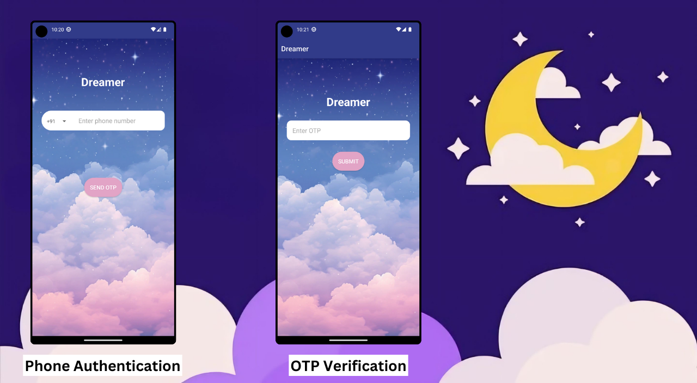

# Dreamer : Interpret, Understand, Dream On
Dreamer is an innovative app designed to help you unlock the hidden meanings behind your dreams. By leveraging the power of Google's Gemini API, Dreamer provides personalized interpretations of your dreams based on the specific details you provide. Simply input the dream you had along with the emotions you felt during the dream, and Dreamer will analyze this information to offer insights and explanations. With Dreamer, you can discover the meaning of your dreams, understand the symbolism and significance behind them, and gain clarity on how your feelings during dreams relate to your waking life. Receive tailored interpretations that make sense of your unique dream experiences and keep a log of your dreams and emotions to identify recurring themes and patterns. Whether you're curious about the mysteries of your subconscious or seeking deeper self-awareness, Dreamer is your go-to tool for dream analysis. Dive into the world of your dreams and uncover the insights that lie within.

## Key Features

1. **Dream Interpretation**
   - The app takes user-inputted dreams and provides probable meanings related to the user's subconscious mind. For this, I have integrated the Gemini API.

2. **User Profile Management**
   - User profile information, including profile pictures, names, and phone numbers, is stored using Firestore.

3. **Real-Time Dream Input and Response History**
   - To ensure a seamless user experience, I have used Firestore to fetch real-time dream inputs and responses, which are displayed in a RecyclerView list.

4. **Firestore Storage**
   - I have utilized Firestore Storage to store the references for profile pictures, names, and phone numbers.

5. **Cache Optimization**
   - For improved performance and user experience, I have implemented a cache optimization strategy using Firebase Realtime Database.

6. **Local Data Storage**
   - The app uses Room Database to store user data locally, enhancing the overall user experience by enabling offline access and faster data retrieval.

## Screenshots




## Getting Started

### Prerequisites

- Kotlin
- Firebase Account
- Gemini API Key

### Installation

1. Clone the repository:
    ```bash
    git clone https://github.com/yourusername/dreamer.git
    ```
2. Open the project in Android Studio.
3. Set up Firebase:
    - Add the `google-services.json` file to the `app` directory.
    - Enable Firestore, Firebase Realtime Database, and Firebase Storage in the Firebase Console.
4. Set up Gemini API:
    - Obtain a Gemini API key and add it to your project.

5. Build and run the app on your Android device or emulator.

## Usage

1. **Sign Up / Log In:**
   - Users can sign up or log in using their email and password.
   
2. **Profile Management:**
   - Users can update their profile information, including uploading a profile picture.

3. **Input Dreams:**
   - Users can input their dreams and receive interpretations based on the Gemini API.

4. **View History:**
   - Users can view their past dream inputs and interpretations in a RecyclerView list.
